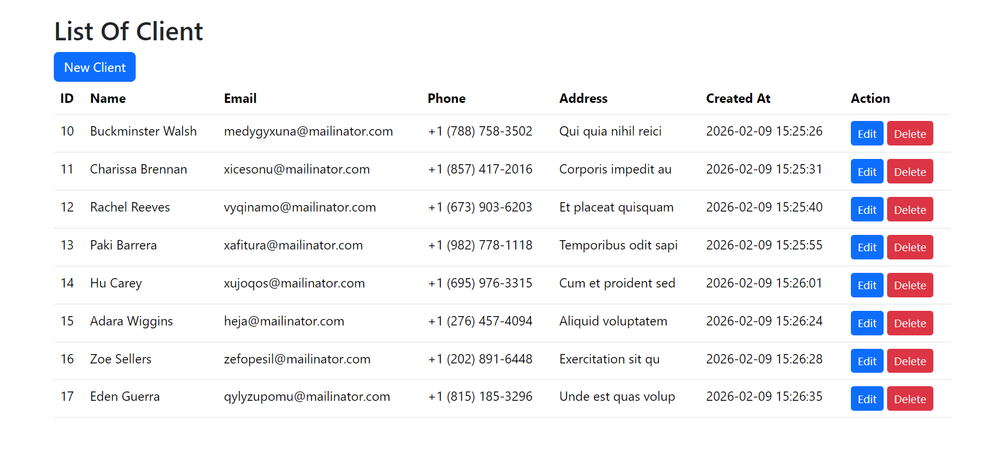
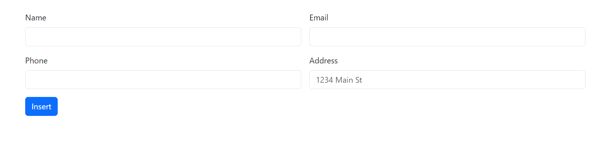
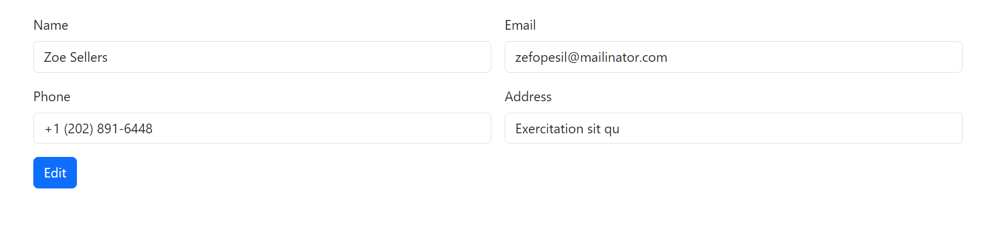

# 🚀 MyShop CRUD Project

Simple CRUD application built using **PHP & MySQL**.

This project was created as a practice project to improve backend development skills, database connection, and building full CRUD logic from scratch.

---

## 📌 Features

- ✅ Display all clients from database
- ✅ Insert new client
- ✅ Edit existing client
- ✅ Delete client
- ✅ Clean table UI using Bootstrap
- ✅ MySQL database connection using mysqli
- ✅ Organized CRUD logic

---

## 🛠️ Technologies Used

* PHP (Core PHP)
* MySQL
* HTML
* Bootstrap
* SQL Queries (CRUD Operations)

---

## 🧠 What I Practiced

* Database connection in PHP
* Writing SQL queries
* CRUD logic implementation
* Handling forms
* Data fetching and displaying
* Thinking step-by-step backend logic

---

## 📸 Project Screenshots

### 🔹 Clients List

---

### 🔹 Insert Client Form

---

### 🔹 Edit Client

---

## ⚙️ How To Run

1. Import database into phpMyAdmin
2. Update database connection in config file
3. Run project using local server (XAMPP / Laragon)
4. Open project in browser

> ⚠️ Make sure Apache and MySQL services are running before starting the project.

---

## 💪 Learning Note

This project logic was built step-by-step independently as part of backend learning journey.

---

## ⭐ Future Improvements

* Add validation
* Prepared statements
* Search & filtering
* Pagination
* API version

---

## 👨‍💻 Author

Youssef Marey

---

